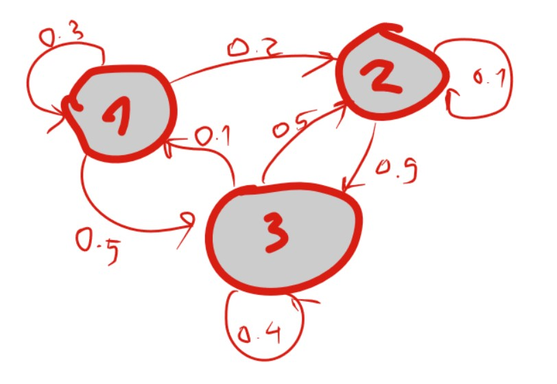

_Table of contents:_
- [Entropy](#entropy)
- [Markov chain](#markov-chain)

## Entropy

Entropy **Η** (letter eta) in the information theory was first introduced by Shannon in 1948 paper: _A Mathematical Theory of Communication_.

$$H(X)=−∑_i P_X ( x_i ) log_b ⁡ P_X ( x_i ) = ∑_i P_X ( x_i ) I_X ( x_i ) = E ⁡ [ I_X ] $$

If units of entropy are bits than $b=2$.

Entropy is a measure of the unpredictability of the state, or equivalently, of its average information content.

The entropy will be equal to 1 when there is no causality, or in another words, when all the options are equally possible.

If we have $N$ the number of options, then entropy will be $log_2 N$.

_Example: Tossing a coin_

$$H ( X ) = − ∑_{i=1}^n P(x_i)log_b ⁡P (x_i) = − ∑_{i=1}^2 1 2 log_2 ⁡ 1/2 = − ∑_{i=1 2 1 2} ⋅ ( − 1 ) = 1$$

## Markov chain

A Markov (named after Andrey Markov) chain is a probabilistic model describing probability to switch from a state to a state as explained in the image.

From a state **1** we can go to a state 1 (recursion), state **2** and state **3**. Sum of all probabilities to switch from a state **1** will add to one.

We can show the matrix to represent the probabilities of switching:

$$mc =\begin{pmatrix} 0.3 & 0.2 & 0.5 \\ 0 & 0.1 & 0.9 \\ 0.1 & 0.5 & 0.4 \end{pmatrix}$$

For Markov chain model each line represents a probability to switch from a state to a state.

The previous states do not affect the probability of the next state, only the action caused to switch to a certain state.

